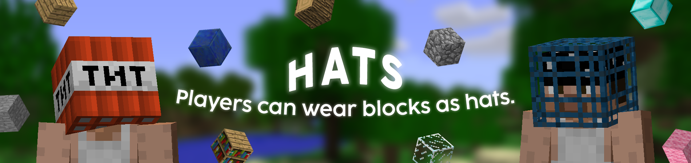

# Hats


## What's Hats?
**Hats** is a Minecraft plugin designed for servers running version b1.7.3.
It allows players to wear blocks in the helmet slot as hats using an in-game command.
Additionally, players can choose to toggle light emission from blocks worn as hats, depending on  which blocks are configured to emit light when worn as hats.

## Features
- Wear the block in hand as a hat. [(ID 1 - 96)](https://imgur.com/RIVgSD7)
- Configurable blocks that emit light around the player, visible to everyone, when worn as hats.
- **Condition checks:** No block held in hand, Item cannot be worn as a hat, Held block is already worn as a hat, Swap between new and old hat, Dropping the old hat on the ground when a new one is equipped with a full inventory.
- Ensures only one unit of a block is worn in the helmet slot, preventing players from using it as an additional inventory slot.
- Checks for a newer version of the plugin and provides a download link in the console if available.

## Download
**Download the latest stable release of Hats [here](https://github.com/AleksandarHaralanov/Hats/releases/latest).**

## Requirements
Your server must be running one of the following APIs: CB1000-CB1092, [Project Poseidon](https://github.com/RhysB/Project-Poseidon) or [UberBukkit](https://github.com/Moresteck/Project-Poseidon-Uberbukkit).

## Usage
### Commands and Permissions
By default, only OPs have permission.

Use PermissionsEx or similar plugins to grant groups the permission, enabling the commands.

- Commands and permissions:
  - `/hat` - **Requires permission** `hats.wear` - Wear the block in hand as a hat.
  - `/hat light` - **Requires permission** `hats.light` - Toggle option for specific hats to emit light when worn.
  - `/hat reload` - **Requires permission** `hats.modify` - Reloads the plugin configuration file.
  - `/hat about` - Prints the plugin's name, version, description, website and author.

- Other permissions:
  - `hats.*` - Wildcard permission granting everything.
  - `hats.perks` - Grants `hats.wear` and `hats.light`.

### Configuration
Upon initial startup, the plugin automatically generates a configuration file located at `plugins/Hats/config.yml`. This file allows you to manage various features.

Default configuration:
```
hat-light:
  enabled: true
  wider: false
  source: [10, 11, 50, 51, 89, 90, 91]
  players: []
```

- `hat-light.enabled` - Enables or disables the plugin's hat light emission feature.
- `hat-light.wider` - Adjusts the radius of the light emitted from hats.
- `hat-light.source` - Add or remove block IDs. These IDs are used by the plugin to identify which blocks emit light when worn as hats.
- `hat-light.players` - Players can use the `/hat light` command to toggle their personal preference for hat light emission, which is saved in this configuration.

If you made changes to the configuration while the server is running, it is <u>strongly recommended</u> to use `/hat reload` to apply the changes instead of `/reload`.