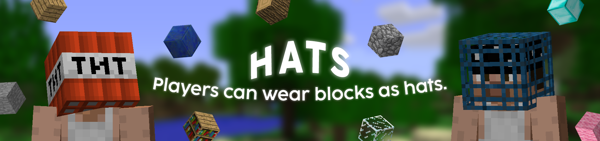

# Hats

## What's Hats?
**Hats** is a Minecraft plugin designed for servers running version b1.7.3, enabling players to wear blocks in the helmet slot as hats through the use of an in-game command.

## Features
- Wear the block in hand as a hat. [(ID 1 - 96)](https://imgur.com/RIVgSD7)
- **Condition checks for:** No block held in hand, Item cannot be worn as a hat, Held block is already worn as a hat, Swap between new and old hat, Dropping the old hat on the ground when a new one is equipped with a full inventory.
- Ensures only one unit of a block is worn in the helmet slot, preventing players from using it as an additional inventory slot.
- Checks for a newer version of the plugin and provides a download link in the console if available.

## Download
- **Download the latest release of Hats [here](github.com/AleksandarHaralanov/Hats/releases/latest).**

## Requirements
- Server must be running a [Poseidon](https://github.com/RhysB/Project-Poseidon) API build from `June 28th, 2024` or later.
  - [Poseidon](https://github.com/RhysB/Project-Poseidon) downloads can be found [here](https://jenkins.glass-launcher.net/job/Project-Poseidon/).

## Usage
By default, only OPs have permission.

Use PermissionsEx or similar plugins to grant groups the permission, enabling the command.
- Commands:
  - `/hat` - **Requires permission** - Wear the block in hand as a hat.
  - `/hat [v | ver | version]` - **Doesn't require permission** - Prints author, version, and a link to this repository.
- Permission: `hats.wear`